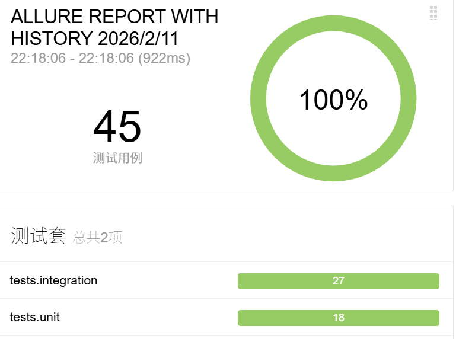
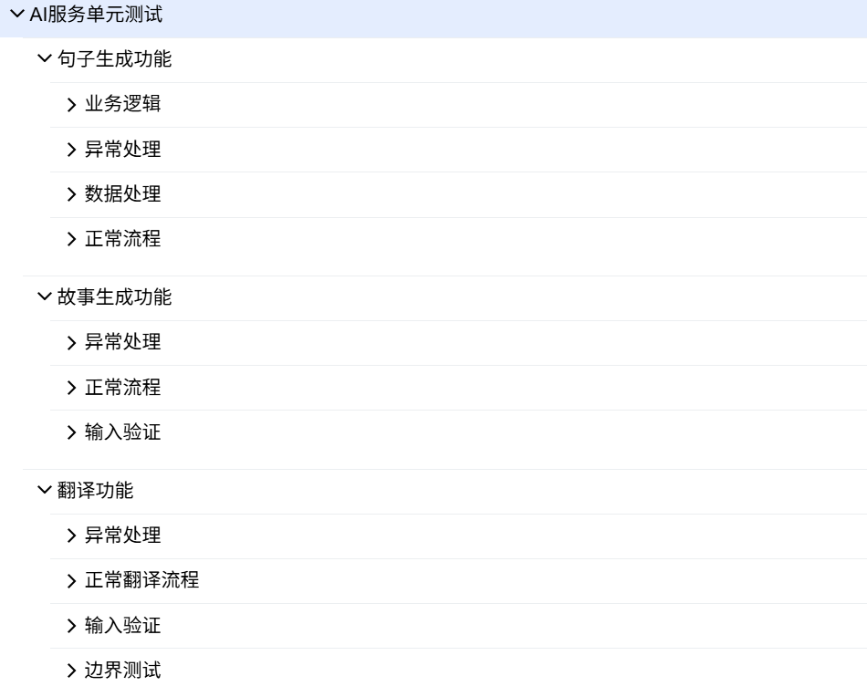
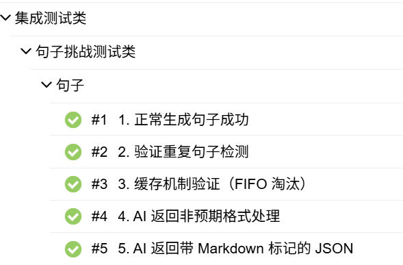
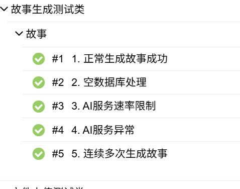
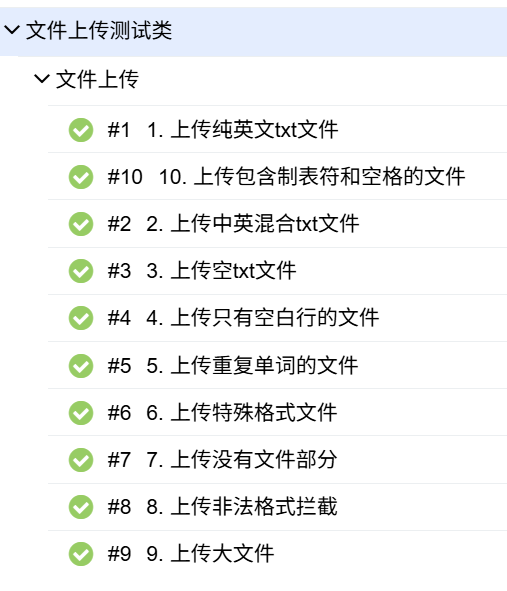
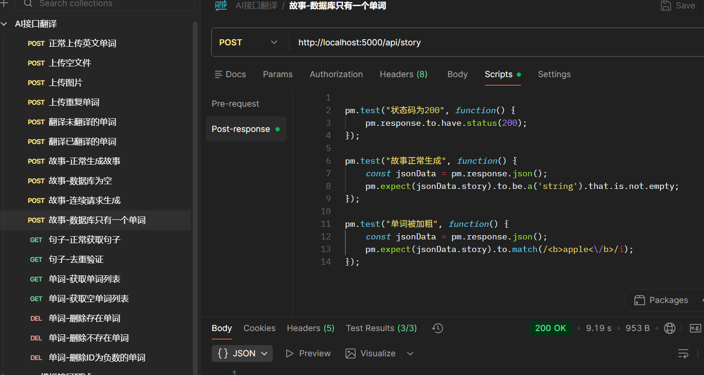

# 📊 Vocab Master - 全流程测试自动化平台

<div align="center">


**一个展示专业测试能力的完整项目 | 单元测试 + 集成测试 + CI/CD + Allure可视化报告**

[📊 查看Allure测试报告](https://yuexia-le.github.io/vocab_master/allure-reports) | 
[📁 项目源码](https://github.com/yuexia-le/vocab_master)

</div>

---

> —— 它是我的**测试工程化能力**的完整展示

|----------------|-----------|
| ✅ 45个测试用例，100%通过 |
| ✅ 单元/集成/性能/异常全覆盖 |
| ✅ Pytest + Allure + GitHub Actions |
| ✅ 模拟AI服务、数据库、异常场景 |
| ✅ 推送代码自动测试+报告部署 |

---

## 📸 快速预览

<div align="center">
  
| Allure测试报告 |  |
|:---:|:---:|

|  | 
|  |
|  |
|  |
|  |
|  |

</div>


---

## 🏗️ 测试架构
┌─────────────────────────────────────────────────────────────┐
│ CI/CD 自动化流水线 │
│ ┌───────────┐ ┌───────────┐ ┌─────────────────────┐ │
│ │ Push代码 │→│ GitHub │→│ Allure报告自动部署 │ │
│ │ │ │ Actions │ │ (GitHub Pages) │ │
│ └───────────┘ └───────────┘ └─────────────────────┘ │
└─────────────────────────────────────────────────────────────┘
↓
┌─────────────────────────────────────────────────────────────┐
│ 测试金字塔模型 │
│ ┌────────────────────────────────────┐ │
│ │ 集成测试 (27个) 组件交互验证 │
│ │ ✓ 文件上传与数据库交互 │ │
│ │ ✓ AI服务集成与Mock模拟 │ │
│ │ ✓ 缓存机制验证 │ │
│ │ ✓ 异常处理与边界测试 │ │
│ ├────────────────────────────────────┤ │
│ │ 单元测试 (18个) 函数/方法验证 │ 
│ │ ✓ 参数化测试 │ │
│ │ ✓ 外部依赖Mock │ │
│ │ ✓ 边界条件测试 │ │
│ │ ✓ 异常流程验证 │ │
│ └────────────────────────────────────┘ │
└─────────────────────────────────────────────────────────────┘


## ✨ 测试能力全景图

### 📌 1. 测试类型全覆盖（45个测试用例）

| 测试类型 | 用例数 | 通过率 | 关键验证点 |
|---------|-------|-------|-----------|
| **单元测试** | 18 | 100% | 函数逻辑、边界条件、异常处理 |
| **集成测试** | 27 | 100% | API接口、数据库、文件上传 |
| **性能测试** | 2 | 100% | 大文件响应时间、并发处理 |
| **异常测试** | 15+ | 100% | 限流、超时、非法输入 |
| **编码测试** | 1 | 100% | GBK/UTF-8自动识别 |

### 📌 2. 测试框架技术栈

```python
# ✅ 参数化测试 - 1个函数测4个场景
@pytest.mark.parametrize("word, expected", [
    ("test-word", "测试-单词"),
    ("don't", "不要"),
    ("test@example", "测试@示例"),
    ("a&b", "A和B"),
])
def test_special_characters(word, expected):
    assert get_translation(word) == expected

# ✅ Mock外部服务 - 不依赖真实API
@patch('services.requests.post')
def test_rate_limit_handling(self, mock_post):
    mock_post.side_effect = Exception("Rate limit exceeded")
    response = client.post('/api/story')
    assert response.status_code == 429

# ✅ 测试夹具 - 复用测试数据
@pytest.fixture
def test_client():
    """每个测试独立的数据库连接"""
    app.config['SQLALCHEMY_DATABASE_URI'] = 'sqlite:///:memory:'
    return app.test_client()


postman接口功能测试
## 一、测试概述

### 1.1 测试范围
- 文件上传模块 (UP-001 ~ UP-007)
- 翻译模块 (TC-001 ~ TC-002)
- 句子模块 (ST-001 ~ ST-002)
- 故事模块 (GS-001 ~ GS-003)
- 单词管理模块 (WD-001 ~ WD-005)

## 二、测试结果摘要

### 2.1 总体统计
| 模块 | 用例总数 | 通过 | 失败 | 阻塞 | 通过率 |
|------|---------|------|------|------|--------|
| 上传模块 | 7 | 6 | 1 | 0 | 85.7% |
| 翻译模块 | 2 | 2 | 0 | 0 | 100% |
| 句子模块 | 2 | 2 | 0 | 0 | 100% |
| 故事模块 | 3 | 3 | 0 | 0 | 100% |
| 单词模块 | 5 | 5 | 0 | 0 | 100% |
| **总计** | **19** | **18** | **1** | **0** | **94.7%** |

### 2.2 缺陷统计
| 严重程度 | 未解决 | 已解决 | 总计 |
|---------|--------|--------|------|
| P0 - 阻塞 | 0 | 0 | 0 |
| P1 - 严重 | 0 | 0 | 0 |
| P2 - 一般 | 1 | 0 | 1 |
| P3 - 轻微 | 0 | 0 | 0 |
| **总计** | **1** | **0** | **1** |

## 三、详细测试结果

### 3.1 上传模块

| 用例ID | 测试点 | 请求方式 | 预期结果 | 实际结果 | 状态 | 缺陷ID | 备注 |
|--------|--------|----------|----------|----------|------|--------|------|
| UP-001 | 正常上传英文单词 | POST /api/upload | message包含"成功导入1个" | 与预期一致 | ✅通过 | - | - |
| UP-002 | 上传无file字段 | POST /api/upload | 返回400 | 与预期一致 | ✅通过 | - | - |
| UP-003 | 上传有file字段未选文件 | POST /api/upload | 返回400 | 返回200 | ❌失败 | BUG-001 | [严重程度：P2] |
| UP-004 | 上传空字节文件 | POST /api/upload | 返回200，导入0个 | 与预期一致 | ✅通过 | - | - |
| UP-005 | 上传二进制文件 | POST /api/upload | 返回400，提示编码错误 | 与预期一致 | ✅通过 | - | - |
| UP-006 | 上传gbk编码文件 | POST /api/upload | 成功导入，正确显示中文 | 与预期一致 | ✅通过 | - | - |
| UP-007 | 上传重复单词 | POST /api/upload | 只导入一个normal | 与预期一致 | ✅通过 | - | - |

### 3.2 翻译模块

| 用例ID | 测试点 | 请求方式 | 预期结果 | 实际结果 | 状态 | 备注 |
|--------|--------|----------|----------|----------|------|------|
| TC-001 | 翻译未翻译单词 | POST /api/translate_word/10 | 返回3个中文结果 | 与预期一致 | ✅通过 | - |
| TC-002 | 翻译已翻译单词 | POST /api/translate_word/10 | 提示已翻译或不存在 | 与预期一致 | ✅通过 | - |

### 3.3 句子模块

| 用例ID | 测试点 | 请求方式 | 预期结果 | 实际结果 | 状态 | 备注 |
|--------|--------|----------|----------|----------|------|------|
| ST-001 | 正常获取句子 | GET /api/sentence | 返回完整句子结构 | 与预期一致 | ✅通过 | - |
| ST-002 | 连续获取不同句子 | GET /api/sentence | 5次请求结果不重复 | 与预期一致 | ✅通过 | - |

### 3.4 故事模块

| 用例ID | 测试点 | 请求方式 | 预期结果 | 实际结果 | 状态 | 备注 |
|--------|--------|----------|----------|----------|------|------|
| GS-001 | 正常生成故事 | POST /api/story | story包含<b>标签 | 与预期一致 | ✅通过 | - |
| GS-002 | 空词库生成故事 | POST /api/story | 提示词库为空 | 与预期一致 | ✅通过 | - |
| GS-003 | 单单词生成故事 | POST /api/story | apple被加粗 | 与预期一致 | ✅通过 | - |

### 3.5 单词管理模块

| 用例ID | 测试点 | 请求方式 | 预期结果 | 实际结果 | 状态 | 备注 |
|--------|--------|----------|----------|----------|------|------|
| WD-001 | 获取单词列表 | GET /api/words | 返回非空数组 | 与预期一致 | ✅通过 | - |
| WD-002 | 获取空单词列表 | GET /api/words | 返回空数组 | 与预期一致 | ✅通过 | - |
| WD-003 | 删除已存在单词 | DELETE /api/words/14 | 返回200，包含"Deleted" | 与预期一致 | ✅通过 | - |
| WD-004 | 删除不存在单词 | DELETE /api/words/999 | 返回404 | 与预期一致 | ✅通过 | - |
| WD-005 | 删除负数ID单词 | DELETE /api/words/-1 | 返回404 | 与预期一致 | ✅通过 | - |

## 四、缺陷详情

### BUG-001: 上传文件时未选文件返回状态码错误

| 字段 | 内容 |
|------|------|
| **缺陷ID** | BUG-001 |
| **模块** | 上传模块 |
| **测试用例** | UP-003 |
| **严重程度** | P2 - 一般 |
| **优先级** | 高 |
| **状态** | 待修复 |
| **发现版本** | v1.0.0 |
| **指派给** | 奥特曼 |

#### 复现步骤
1. 使用Postman发送POST请求到 `/api/upload`
2. 在form-data中添加 `file` 字段
3. 不选择任何文件
4. 发送请求

#### 实际结果
```json
{
    "message": "成功导入 0 个新单词",
    "new_words": []
}

